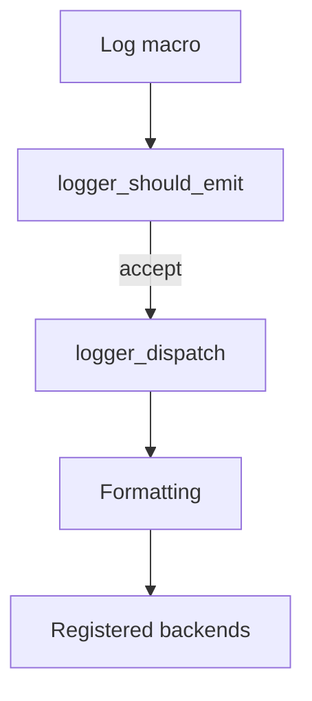
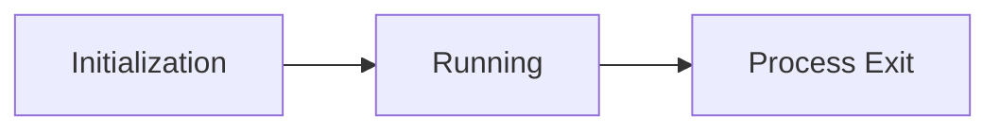

# Synchronous Prototype — Specification

**Status:** Frozen  
**Version:** 0.0.1  
**Last Updated:** 2026-05-14  
**Owner:** André Gustavo  

---

## 1. Overview

O Logger é o subsistema de observabilidade da Dynora Engine responsável por registrar eventos de execução com custo baixo e formato previsível.

Esta versão existe para validar:

- API pública;
- filtro por nível e categoria;
- formatação das mensagens;
- timestamp monotônico;
- sequência incremental;
- registro de backends;
- integração com o backend de console.

A implementação desta versão é síncrona e serve como base de validação funcional do contrato do logger.

---

## 2. Scope

### 2.1 Included in 0.0.1

- Inicialização do logger.
- Configuração dinâmica de nível.
- Configuração dinâmica de máscara de categoria.
- Filtro por nível e categoria.
- Macros públicas de log.
- Dispatch interno.
- Timestamp monotônico.
- Sequência incremental.
- Evento de log com buffer fixo.
- Backend pluggable.
- Backend de console.
- Validações em debug com assert.

### 2.2 Explicitly NOT included

- Fila assíncrona.
- Worker thread.
- MPSC bounded queue.
- Batching.
- Policy layer.
- Overflow policy.
- Shutdown controlado em máquina de estados.
- Métricas internas completas.
- Thread-safety.
- Deferred formatting.
- Integração com job system.
- Telemetria remota.
- Logging distribuído.

---

## 3. Architecture

O fluxo do sistema é síncrono:


O backend é chamado imediatamente no mesmo fluxo da chamada.

---

## 4. Core Concepts

### 4.1 Log Level

O nível representa a severidade do evento.

A ordem semântica é:

- `DEBUG`
- `INFO`
- `WARNING`
- `ERROR`
- `FATAL`

Níveis mais altos são mais severos.

### 4.2 Category Mask

Categorias são representadas como bitmask (`uint32_t`) e usadas para filtrar origem dos logs.
Uma categoria é aceita quando seu bit está presente na máscara ativa.

### 4.3 Log Event

O evento de log é a estrutura entregue ao backend.

Ele contém:

- timestamp monotônico;
- sequência incremental;
- arquivo de origem;
- função de origem;
- linha;
- categoria;
- nível;
- mensagem formatada;
- campo reservado para extensões futuras.

### 4.4 Backend

Backend é o destino do log.

O backend é executado de forma síncrona e imediata.

---

## 5. Data Model

### 5.1 Níveis de log

```c
enum DynoraLogLevel {
    DYNORA_LEVEL_DEBUG = 0,
    DYNORA_LEVEL_INFO,
    DYNORA_LEVEL_WARNING,
    DYNORA_LEVEL_ERROR,
    DYNORA_LEVEL_FATAL,
    DYNORA_LEVEL_COUNT,
};
```

Regras:
- o valor numérico cresce com a severidade;
- `DYNORA_LEVEL_COUNT` é sentinela e não é um nível válido.

### 5.2 Categoria

```c
typedef uint32_t DynoraLogCategory;
```

Categorias atuais:

```c
#define DYNORA_LOG_RENDER   ((DynoraLogCategory)(1u << 0))
#define DYNORA_LOG_AUDIO    ((DynoraLogCategory)(1u << 1))
#define DYNORA_LOG_PHYSICS  ((DynoraLogCategory)(1u << 2))
#define DYNORA_LOG_ECS      ((DynoraLogCategory)(1u << 3))
#define DYNORA_LOG_IO       ((DynoraLogCategory)(1u << 4))
#define DYNORA_LOG_GENERAL  ((DynoraLogCategory)(1u << 5))
```

E máscaras utilitárias:

```c
#define DYNORA_LOG_NONE ((DynoraLogCategory)0)
#define DYNORA_LOG_ALL                                                    \
    (DYNORA_LOG_RENDER | DYNORA_LOG_AUDIO | DYNORA_LOG_PHYSICS |          \
        DYNORA_LOG_ECS | DYNORA_LOG_IO | DYNORA_LOG_GENERAL)
```

Regras:

- a categoria é uma máscara de bits;
- uma mensagem é aceita apenas se a categoria estiver habilitada na máscara ativa.

### 5.3 Evento de log

```c
typedef struct DynoraLogEvent {
    uint64_t timestamp;
    uint64_t sequence;
    const char* file;
    const char* function;
    void* user_data;
    char message[DYNORA_LOG_MESSAGE_MAX];
    uint32_t line;
    DynoraLogCategory category;
    uint8_t level;
} DynoraLogEvent;
```

Regras:

- `timestamp` é monotônico em nanosegundos;
- `sequence` é um contador incremental;
- `message` usa buffer fixo;
- `mensagem` pode ser truncada se exceder `DYNORA_LOG_MESSAGE_MAX`;
- buffer é sempre terminado com `\0`;
- `user_data` existe como campo reservado;
- o evento só é válido durante a execução do backend, e backends não devem guardar ponteiros para ele sem copiar os dados.

---

## 6. Execution Model

A execução é síncrona.

Fluxo:

1. macro captura contexto;
2. `logger_should_emit(...)` decide se o evento deve ser emitido;
3. `logger_dispatch(...)` constrói o evento;
4. mensagem é formatada;
5. os backends registrados são chamados imediatamente.

Características:

- sem fila;
- sem worker thread;
- sem desacoplamento entre produção e consumo;
- sem processamento assíncrono.
- Não existe transferência de propriedade assíncrona.

---

## 7. API

### 7.1 Public API

```c
void logger_init(enum DynoraLogLevel level, DynoraLogCategory category);
void logger_set_level(enum DynoraLogLevel level);
void logger_set_category_mask(DynoraLogCategory category);
bool logger_should_emit(DynoraLogCategory category, enum DynoraLogLevel level);
void logger_dispatch(DynoraLogCategory category,
                     enum DynoraLogLevel level,
                     const char* file,
                     uint32_t line,
                     const char* function,
                     const char* fmt,
                     ...);
```

### 7.2 Public Macros

```c
#define DYNORA_LOG(cat, level, fmt, ...)
#define DYNORA_LOG_DEBUG(cat, fmt, ...)
#define DYNORA_LOG_INFO(cat, fmt, ...)
#define DYNORA_LOG_WARNING(cat, fmt, ...)
#define DYNORA_LOG_ERROR(cat, fmt, ...)
#define DYNORA_LOG_FATAL(cat, fmt, ...)
```

### 7.3 Contract

Regras:

- as macros são a interface de uso normal;
- Nas macros públicas, não usar as máscaras utilitárias `DYNORA_LOG_NONE` e `DYNORA_LOG_ALL` como categoria de emissão.

#### `logger_init`
Define:
- nível mínimo de emissão
- máscara de categorias ativa
- contador de sequência inicializado em zero
- lista de backends zerada

#### `logger_set_level` e `logger_set_category_mask`
Define:
-  Alteram o comportamento em runtime.

#### `logger_should_emit`
Define:
- categoria ativa
- nível mínimo
- precisar ser barato

#### `logger_dispatch`
Define:
- função de infraestrutura. 
- não deve ser chamada diretamente pelo código do usuário.

### 7.4 Debug validation

Na build de debug, o logger valida invariantes com `assert`, incluindo:

- `level < DYNORA_LEVEL_COUNT`;
- `fmt != NULL`.

Em release, essas validações não executam, e o logger deve falhar de forma segura por early return.

---

## 8. Lifecycle

Não possui uma máquina de estados formal.

O ciclo de vida observado é:


Regras:

- `logger_init(...)` prepara o estado inicial;
- após a inicialização, o logger aceita uso normal;
- esta versão não define shutdown controlado;
- o encerramento segue o ciclo de vida normal do processo.

---

## 9. Concurrency & Synchronization

Não é thread-safe.

Estado global compartilhado inclui:

- contador de sequência;
- nível atual;
- máscara de categoria;
- lista de backends;
- contador de backends.

Regras:

- esta versão deve ser usada como validação funcional;
- não há sincronização para acesso concorrente;
- não há garantia de segurança em múltiplas threads.

---

## 10. Performance Model

Objetivo desta versão:

- custo baixo para filtrar eventos;
- formatação e despacho apenas quando o evento é aceito;
- comportamento simples e previsível.

Regras:

- eventos rejeitados devem ter custo mínimo;
- o filtro deve evitar trabalho desnecessário;
- a implementação usa buffer fixo para a mensagem;
- não há alocação de fila ou estruturas assíncronas.

---

## 11. Failure Model

### 11.1 Mensagem maior que o buffer

A mensagem pode ser truncada quando excede `DYNORA_LOG_MESSAGE_MAX`.

### 11.2 Nível inválido

`level >= DYNORA_LEVEL_COUNT` é uso inválido.

- em debug: `assert`;
- em release: early return seguro.

### 11.3 `fmt == NULL`

`fmt == NULL` é uso inválido.

- em debug: `assert`;
- em release: early return seguro.

### 11.4 Backend mal comportado

Backends não devem:

- modificar o evento;
- assumir ownership do evento;
- manter ponteiros para campos do evento sem copiar os dados.

---

## 12. Backends / Integrations

### 12.1 Backend contract

```c
void (*write)(const DynoraLogEvent* event, void* user_data);
```

### 12.2 Regras
- backends recebem eventos prontos;
- backends não filtram;
- backends não alteram o evento;
- backends não assumem ownership do evento;
- backends executam no mesmo fluxo da chamada.

### 12.3 Backend existente

Esta versão inclui backend de console, usado para validação do pipeline atual.

---

## 13. Metrics & Observability

A 0.0.1 não define métricas internas completas.

O que existe nesta versão:

- sequência incremental;
- timestamp monotônico;
- visibilidade via backend de console.

Não faz parte da 0.0.1:

- ocupação de fila;
- total enfileirado;
- total processado;
- descartes por overflow;
- descartes por shutdown.

---

## 14. Guarantees

### Garantias desta versão

- filtro por nível e categoria;
- timestamp monotônico;
- sequência incremental;
- evento com buffer fixo;
- backend pluggable;
- backend de console funcional;
- validações em debug para uso incorreto.

---

## 15. Migration / Evolution Path

A 0.0.1 é uma base de validação.

Evoluções futuras podem incluir:

- fila bounded MPSC;
- worker thread;
- policy layer;
- métricas internas;
- shutdown controlado;
- integração com job system.

Essas evoluções não fazem parte da 0.0.1.

---

## 16. Notes

- Esta spec descreve apenas o comportamento realmente implementado.
- A 0.0.1 existe para validar contrato, formato e integração básica.
- Qualquer arquitetura assíncrona deve ser documentada em uma spec posterior.
