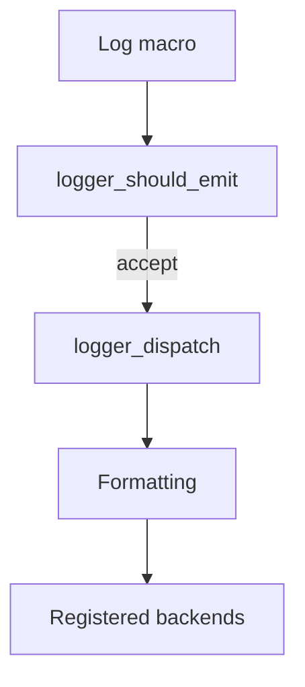
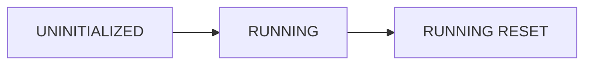

# Synchronous Prototype — Specification

**Status:** Stable Prototype
**Version:** 0.0.1  
**Last Updated:** 2026-05-22  
**Owner:** André Gustavo  

---

## 1. Overview

O Logger é o subsistema de observabilidade da Dynora Engine responsável por registrar eventos de execução com custo baixo e formato previsível.

Esta versão existe para validar:

- API pública;
- filtro por nível e categoria;
- formatação das mensagens;
- timestamp monotônico;
- sequência incremental;
- registro de backends;
- integração com o backend de console.

A implementação desta versão é síncrona e serve como base de validação funcional do contrato do logger. O sistema é global, stateful e não thread-safe nesta versão.

---

## 2. Scope

### 2.1 Included in 0.0.1

- Inicialização do logger.
- Configuração dinâmica de nível mínimo.
- Configuração dinâmica de máscara de categoria.
- Filtro por nível e categoria.
- Macros públicas de log.
- Construção síncrona do evento.
- Timestamp monotônico.
- Sequência incremental.
- Evento de log com buffer fixo.
- Backend pluggable.
- Backend de console.
- Validações em debug com `assert`.

### 2.2 Explicitly NOT included

- Fila assíncrona.
- Worker thread.
- MPSC bounded queue.
- Batching.
- Policy layer.
- Overflow policy.
- Shutdown controlado em máquina de estados.
- Métricas internas completas.
- Thread-safety.
- Deferred formatting.
- Integração com job system.
- Telemetria remota.
- Logging distribuído.

---

## 3. Architecture

O fluxo do sistema é síncrono:


```mermaid
graph TD;
A[Log macro] --> B[logger_should_emit]
B -->|accept| C[logger_dispatch]
C --> D[Formatting]
D --> E[Registered backends]
```
### Responsabilidades
- `Macro de log`: captura contexto de chamada e invoca o fluxo público.
- `logger_should_emit`: decide se o evento passa no filtro.
- `logger_dispatch`: constrói o evento e executa o dispatch.
- `Backends`: consomem o evento já pronto, no mesmo fluxo da chamada.

O backend é chamado imediatamente no mesmo fluxo da chamada.

O logger é um subsistema de observabilidade.

Ele não deve ser tratado como:

- event bus genérico;
- sistema de mensagens universal;
- mecanismo central de comunicação entre módulos.

Outros sistemas não devem depender semanticamente do logger
para coordenação de runtime.

---

## 4. Core Concepts

### 4.1 Log Level

O nível representa a severidade do evento.

A ordem semântica é:

- `TRACE`
- `DEBUG`
- `INFO`
- `WARNING`
- `ERROR`
- `FATAL`

Níveis mais altos são mais severos.

### 4.2 Category

Uma categoria representa a origem lógica do log.
Categorias são representadas por um enum sequencial.
Cada mensagem pertence a exatamente uma categoria principal.

### 4.3 Category Mask

Máscaras de categoria são usadas para filtrar quais categorias estão habilitadas.
A máscara é representada como `uint64_t`.
Uma categoria é aceita quando seu bit correspondente está habilitado na máscara ativa.

### 4.4 Log Event

O evento de log é a estrutura entregue ao backend.

Ele contém:

- timestamp monotônico;
- sequência incremental;
- arquivo de origem;
- função de origem;
- linha;
- categoria;
- nível;
- mensagem formatada;

O timestamp é monotônico dentro do processo e expresso em nanosegundos.
A implementação atual usa a clock monotônica da plataforma:
- Windows
  - `QueryPerformanceCounter`
  - `QueryPerformanceFrequency`
- POSIX
  - `CLOCK_MONOTONIC`

### 4.5 Backend

Backend é o destino do log.

O backend é executado de forma síncrona e imediata.

---

## 5. Data Model

### 5.1 Log Levels

```c
typedef enum DynoraLogLevel {
    DYNORA_LEVEL_TRACE = 0,
    DYNORA_LEVEL_DEBUG,
    DYNORA_LEVEL_INFO,
    DYNORA_LEVEL_WARNING,
    DYNORA_LEVEL_ERROR,
    DYNORA_LEVEL_FATAL,
    DYNORA_LEVEL_COUNT
} DynoraLogLevel;
```

Regras:
- o valor numérico cresce com a severidade;
- `DYNORA_LEVEL_COUNT` é sentinela e não é um nível válido.
- o nível deve caber em `uint8_t`.

### 5.2 Category
```c
typedef enum DynoraLogCategory {
    DYNORA_LOG_CATEGORY_RENDER = 0,
    DYNORA_LOG_CATEGORY_AUDIO,
    DYNORA_LOG_CATEGORY_PHYSICS,
    DYNORA_LOG_CATEGORY_ECS,
    DYNORA_LOG_CATEGORY_IO,
    DYNORA_LOG_CATEGORY_GENERAL,

    DYNORA_LOG_CATEGORY_COUNT
} DynoraLogCategory;
```

Regras:
- categorias são identificadores sequenciais;
- cada log pertence a uma única categoria;
- `DYNORA_LOG_CATEGORY_COUNT` é sentinela e não é categoria válida.

### 5.3 Category Mask

```c
typedef uint64_t DynoraLogCategoryMask;
```
Helper principal:

```c
#define DYNORA_LOG_CATEGORY_BIT(cat) \
    ((DynoraLogCategoryMask)1ull << (cat))
```

Máscaras utilitárias:

```c
#define DYNORA_LOG_CATEGORY_MASK_NONE \
    ((DynoraLogCategoryMask)0ull)

#define DYNORA_LOG_CATEGORY_MASK_ALL \
    ((DynoraLogCategoryMask)((1ull << DYNORA_LOG_CATEGORY_COUNT) - 1ull))
```

Exemplos de máscaras por categoria:

```c
#define DYNORA_LOG_CATEGORY_RENDER_MASK \
    DYNORA_LOG_CATEGORY_BIT(DYNORA_LOG_CATEGORY_RENDER)
#define DYNORA_LOG_CATEGORY_AUDIO_MASK \
    DYNORA_LOG_CATEGORY_BIT(DYNORA_LOG_CATEGORY_AUDIO)
#define DYNORA_LOG_CATEGORY_PHYSICS_MASK \
    DYNORA_LOG_CATEGORY_BIT(DYNORA_LOG_CATEGORY_PHYSICS)
#define DYNORA_LOG_CATEGORY_ECS_MASK \
    DYNORA_LOG_CATEGORY_BIT(DYNORA_LOG_CATEGORY_ECS)
#define DYNORA_LOG_CATEGORY_IO_MASK \
    DYNORA_LOG_CATEGORY_BIT(DYNORA_LOG_CATEGORY_IO)
#define DYNORA_LOG_CATEGORY_GENERAL_MASK \
    DYNORA_LOG_CATEGORY_BIT(DYNORA_LOG_CATEGORY_GENERAL)
```

Regras:

- a máscara é usada apenas para filtro/configuração runtime;
- categorias individuais não são máscaras;
- o sistema atual suporta até 64 categorias.
- a máscara permite combinação usando OR bit a bit.
    - Ex: `DYNORA_LOG_CATEGORY_RENDER_MASK | DYNORA_LOG_CATEGORY_IO_MASK`

### 5.4 Log Event

```c
typedef struct DynoraLogEvent {
    uint64_t timestamp;
    uint64_t sequence;
    const char* file;
    const char* function;
    char message[DYNORA_LOG_MESSAGE_MAX];
    uint32_t line;
    DynoraLogCategory category;
    uint8_t level;
} DynoraLogEvent;
```

Regras:

- `timestamp` é monotônico em nanosegundos;
- `sequence` é um contador incremental;
- `message` usa buffer fixo;
- `mensagem` pode ser truncada se exceder `DYNORA_LOG_MESSAGE_MAX`;
- buffer é sempre terminado com `\0`;
- o evento só é válido durante a execução do backend
- backends não devem guardar ponteiros para ele sem copiar os dados.

### 5.5 Result Codes

```c
typedef enum DynoraLoggerResult {
    DYNORA_LOGGER_SUCCESS = 0,

    DYNORA_LOGGER_ERROR_NOT_INITIALIZED,

    DYNORA_LOGGER_ERROR_NULL_BACKEND,

    DYNORA_LOGGER_ERROR_BACKEND_LIMIT

} DynoraLoggerResult;
```

Regras:

- `SUCCESS` indica conclusão da operação;
- demais valores representam falhas recuperáveis;
- falhas não modificam o estado interno do logger.

---

## 6. Ownership Model

| Resource          | Owner         | Lifetime           | Shared? |
| ----------------- | ------------- | ------------------ | ------- |
| DynoraLogEvent    | Logger        | call scope         | no      |
| Backend registry  | Logger        | runtime            | yes     |
| Category mask     | Logger        | runtime            | yes     |
| Minimum level     | Logger        | runtime            | yes     |
| Backend user_data | Backend owner | runtime / external | yes     |

Regras:

- o evento é temporário e não é transferido para o backend;
- backends não assumem ownership do evento;
- referências ao evento não podem escapar do callback;
- `user_data` pertence ao chamador que registrou o backend, e sua validade é responsabilidade dele.

---

## 7. Execution Model

A execução é síncrona.

Fluxo:

1. macro captura contexto;
2. `logger_should_emit(...)` decide se o evento deve ser emitido;
3. `logger_dispatch(...)` constrói o evento;
4. mensagem é formatada;
5. os backends registrados são chamados imediatamente.

Características:

- sem fila;
- sem worker thread;
- sem desacoplamento entre produção e consumo;
- sem processamento assíncrono.
- Não existe transferência de propriedade assíncrona.

---

## 8. Thread Affinity

| Operation                  | Affinity                       | Notes                    |
| -------------------------- | ------------------------------ | ------------------------ |
| `logger_init`              | Any thread / bootstrap only    | não thread-safe          |
| `logger_set_level`         | Any thread / unsafe concurrent | estado global            |
| `logger_set_category_mask` | Any thread / unsafe concurrent | estado global            |
| `logger_should_emit`       | Any thread / unsafe concurrent | leitura de estado global |
| `logger_dispatch`          | Any thread / unsafe concurrent | executa inline           |
| backend `write(...)`       | mesmo thread da chamada        | síncrono                 |

Regras:

- esta versão não é thread-safe;
- não há garantia de segurança em múltiplas threads;
- o sistema não define sincronização externa;
- uso concorrente é comportamento não suportado.

---

## 9. API

### 9.1 Public API

```c
void logger_init(enum DynoraLogLevel minimum_level,
                 DynoraLogCategoryMask enabled_categories);

void logger_set_level(enum DynoraLogLevel minimum_level);

void logger_set_category_mask(
    DynoraLogCategoryMask enabled_categories);

bool logger_should_emit(enum DynoraLogCategory category,
                        enum DynoraLogLevel level);

void logger_dispatch(enum DynoraLogCategory category,
                     enum DynoraLogLevel level,
                     const char* file,
                     uint32_t line,
                     const char* function,
                     const char* fmt,
                     ...);

DynoraLoggerResult logger_add_backend(
    void (*write)(const DynoraLogEvent*, void*),
    void* user_data);
```

### 9.2 Public Macros

```c
#define DYNORA_LOG(cat, level, fmt, ...)
#define DYNORA_LOG_TRACE(cat, fmt, ...)
#define DYNORA_LOG_DEBUG(cat, fmt, ...)
#define DYNORA_LOG_INFO(cat, fmt, ...)
#define DYNORA_LOG_WARNING(cat, fmt, ...)
#define DYNORA_LOG_ERROR(cat, fmt, ...)
#define DYNORA_LOG_FATAL(cat, fmt, ...)
```

### 9.3 Internal API

```c
void backend_console_init(void);
```
- uso exclusivo interno de integração;
- não é contrato público do logger;
- não deve ser chamado por código de usuário final.

### 9.4 Contract

Regras:

- as macros são a interface de uso normal;
- `logger_dispatch(...)` é infraestrutura interna;
- código de usuário não deve chamar `logger_dispatch(...)` diretamente;
- categorias inválidas são uso incorreto;
- níveis inválidos são uso incorreto.
- nas macros públicas, apenas valores válidos de `DynoraLogCategory` devem ser usados 
como categoria de emissão.
- máscaras utilitárias como `DYNORA_LOG_CATEGORY_MASK_NONE` e
`DYNORA_LOG_CATEGORY_MASK_ALL` não são categorias válidas de emissão.

#### `logger_init`

Inicializa ou reinicializa completamente o runtime do logger.

A chamada:

- redefine sequência em zero;
- redefine nível mínimo global;
- redefine máscara de categorias;
- remove todos os backends registrados anteriormente;
- retorna o logger ao estado operacional inicial.

`logger_init(...)` pode ser chamado múltiplas vezes.

A implementação atual não suporta:

- chamadas concorrentes;
- reinitialization durante dispatch;
- sincronização externa implícita.

#### `logger_set_level` 
- Altera o nível mínimo global em runtime.

#### `logger_set_category_mask`
-  Altera a máscara de categorias habilitadas em runtime.

#### `logger_should_emit`
Define:
- rejeita categorias inválidas;
- rejeita níveis inválidos;
- verifica máscara de categoria;
- verifica nível mínimo global;
- deve ser barato.

#### `logger_dispatch`
Define:
- constrói o evento;
- formata a mensagem;
- chama os backends registrados;
- executa de forma síncrona;
- não faz alocação dinâmica.

#### `logger_add_backend`
Registra um backend síncrono no registry interno.
Retornos possíveis:

| Result                | Significado             |
| --------------------- | ----------------------- |
| SUCCESS               | Backend registrado      |
| ERROR_NOT_INITIALIZED | Logger não inicializado |
| ERROR_NULL_BACKEND    | Callback write é NULL   |
| ERROR_BACKEND_LIMIT   | Limite máximo atingido  |

Define:

- o backend é registrado em ordem de inserção;
- o callback deve permanecer válido durante o uso;
- falhas não alteram o estado interno.

### 9.5 Debug validation

Na build de debug, o logger valida invariantes com `assert`, incluindo:

- categoria válida;
- nível válido;
- `fmt != NULL`.

Em release, essas validações não executam, e o logger deve falhar de forma segura por early return.

---

## 10. ABI & Compatibility

Este subsistema expõe um contrato C como boundary principal.

Regras:

- mudanças incompatíveis devem gerar nova versão;
- estruturas públicas devem preservar layout quando possível;
- módulos externos não devem depender de detalhes internos;
- símbolos experimentais devem ser claramente identificados.

Notas:

- a ABI pública da Dynora utiliza C como boundary principal;
- implementações internas não devem vazar detalhes binários para módulos externos.

---

## 11. Lifecycle

### 11.1 Runtime State Model

O logger possui um modelo de estado simples nesta versão.


```mermaid
flowchart LR
A[UNINITIALIZED] --> B[RUNNING]
B --> C[RUNNING RESET]
```
#### `UNINITIALIZED`

Estado inicial do processo.

Neste estado:

- o logger ainda não possui configuração válida;
- não existem backends registrados;
- emissão de logs não é suportada.

Operações permitidas:

- `logger_init(...)`

Operações não suportadas:

- `logger_dispatch(...)`
- `logger_add_backend(...)`: retorna DYNORA_LOGGER_ERROR_NOT_INITIALIZED
- `logger_set_level(...)`
- `logger_set_category_mask(...)`

Em debug:

- uso incorreto pode gerar `assert`.

Em release:

- operações inválidas devem falhar de forma segura via `early return`.

#### `RUNNING`

Estado operacional normal.

Neste estado:

- emissão síncrona de logs é suportada;
- filtros podem ser alterados;
- backends podem ser registrados.

#### `RUNNING RESET`

`logger_init(...)` pode ser chamado múltiplas vezes.

Cada chamada executa um reset completo do runtime do logger.

O reset redefine:

- backend registry;
- contador de sequência;
- nível mínimo;
- máscara de categorias.

Backends previamente registrados são removidos.

O reset não preserva estado anterior.

#### Unsupported Lifecycle Behavior

Os seguintes comportamentos não são suportados na 0.0.1:

- `logger_init(...)` concorrente;
- `logger_init(...)` durante dispatch;
- reinitialization recursiva;
- mutação de backend registry durante dispatch;
- uso concorrente sem sincronização externa.

---

## 12. Concurrency & Synchronization

Não é thread-safe.

Estado global compartilhado inclui:

- contador de sequência;
- nível atual;
- máscara de categoria;
- lista de backends;
- contador de backends.

Regras:

- não há sincronização para acesso concorrente;
- não há garantia de segurança em múltiplas threads.

A ausência de sincronização faz parte do contrato desta versão.

O sistema assume:

- uso single-threaded;
ou
- sincronização externa definida pelo chamador.

Uso concorrente sem sincronização externa é comportamento não suportado.

---

## 13. Performance Model

Objetivo desta versão:

- filtro barato para eventos rejeitados;
- evitar formatação desnecessária;
- comportamento previsível;
- evitar alocação dinâmica.

Regras:

- eventos rejeitados devem ter custo mínimo;
- `vsnprintf` executa apenas após aprovação do filtro;
- o logger usa buffer fixo para mensagens;
- o dispatch é síncrono;
- não existe fila.
- o número máximo de backends nesta versão é fixo e limitado por implementação.

---

## 14. Failure Model

### 14.1 Mensagem maior que o buffer

A mensagem pode ser truncada quando excede `DYNORA_LOG_MESSAGE_MAX`.

### 14.2 Categoria inválida

Categoria inválida é uso incorreto.

- debug: `assert`;
- release: `early return`.

### 14.3 Nível inválido

Nível inválido é uso incorreto.

- em debug: `assert`;
- em release: `early return`.

### 14.4 `fmt == NULL`

`fmt == NULL` é uso inválido.

- em debug: `assert`;
- em release: `early return`.

### 14.5 Backend mal comportado

Backends não devem:

- modificar o evento;
- assumir ownership do evento;
- manter ponteiros para campos do evento sem copiar os dados.
- chamar a API pública de logging durante `write(...)`.
- registrar backends durante dispatch.
- remover backends durante dispatch;
- reinicializar o logger durante dispatch.

Mutação do backend registry durante iteração é comportamento não suportado nesta versão.

A 0.0.1 não fornece isolamento de falha entre backends.

Consequências:

- backend lento pode atrasar dispatch;
- backend bloqueante bloqueia o fluxo síncrono;
- backend defeituoso pode afetar observabilidade global.

A implementação atual assume backends cooperativos.

### 14.6 Sem backends registrados

Se não houver backends registrados,`logger_dispatch(...)` retorna sem efeito.

### 14.7 Backend Registration Failure

`logger_add_backend(...)` pode falhar quando:

- logger não inicializado;
- callback write é NULL;
- limite máximo de backends atingido.

Nesses casos:

- nenhum backend é registrado;
- `backend_count` não é modificado;
- o estado interno permanece inalterado.

---

## 15. Metrics & Observability

A 0.0.1 não define métricas internas completas.

O que existe nesta versão:

- sequência incremental;
- timestamp monotônico;
- visibilidade via backend de console.
- contagem fixa de backends registrados.

Não faz parte da 0.0.1:

- ocupação de fila;
- métricas de throughput;
- métricas de overflow;
- descartes;
- métricas de shutdown.

---

## 16. Guarantees

### Garantias desta versão

- filtro por nível e categoria;
- timestamp monotônico;
- sequência incremental;
- evento com buffer fixo;
- registro de backend com falha explícita
- backend de console funcional;
- validações em debug para uso incorreto.
- execução síncrona no mesmo fluxo da chamada;
- backend recebe evento pronto e temporário.
- reset explícito via `logger_init(...)`;
- ownership temporário explícito do evento;
- ausência explícita de thread-safety;
- ausência explícita de isolamento de backend.

---

## 17. Migration / Evolution Path

A 0.0.1 é uma base de validação.

Evoluções futuras podem incluir:

- fila bounded MPSC;
- worker thread;
- deferred formatting;
- métricas internas;
- shutdown controlado;
- integração com job system.
- compile-time stripping por nível.

Essas evoluções não fazem parte da 0.0.1.

---

## 18. Notes

- Esta spec descreve apenas o comportamento realmente implementado.
- Esta versão existe para validar contrato e pipeline básico.
- A implementação atual prioriza simplicidade e previsibilidade.
- Arquitetura assíncrona será documentada em spec futura.
- `logger_init(...)` exige logger em estado RUNNING.
