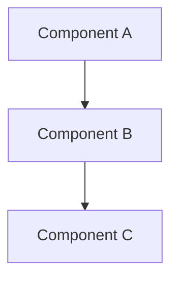
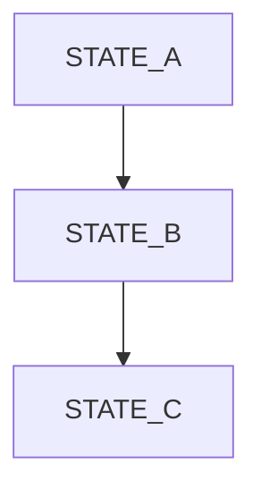

# <System Name> — Specification

**Version:** 0.0.1  
**Status:** Draft | Active | Frozen  
**Last Updated:** YYYY-MM-DD  
**Owner:** <name/team>

---

## 1. Overview

O que é o sistema e por que ele existe.

- propósito do sistema
- problema que resolve
- papel dentro do produto/engine

---

## 2. Scope

### 2.1 Included in V<version>

- funcionalidades principais desta spec
- comportamentos obrigatórios

### 2.2 Explicitly NOT included

- o que este sistema NÃO faz
- responsabilidades explicitamente excluídas

---

## 3. Architecture

Descrição de alto nível do sistema.

- componentes principais
- fluxo entre componentes
- responsabilidades de cada parte

_(diagramas podem ser incluídos aqui se necessário)_


---

## 4. Core Concepts

Definições essenciais para entender o sistema.

### 4.1 Concept A

Descrição

### 4.2 Concept B

Descrição

### 4.3 Entity C

Descrição

---

## 5. Data Model

Estruturas principais e regras associadas.

```c
typedef struct {
    // fields
} ExampleStruct;
```

- entidades principais
- relações
- regras de ownership e ciclo de vida
- mutabilidade (o que pode ou não ser alterado)

---

## 6. Execution Model

Como o sistema se comporta em runtime.

- modelo de threads / concorrência
- regras de execução (sync/async)
- scheduling ou fluxo principal
- regras de bloqueio (o que pode travar o quê)

---

## 7. API

### 7.1 Public API

```c
// function signatures
```

- funções expostas
- contratos principais
- garantias de uso

Regras:

- o que é permitido
- o que é proibido
- expectativas de performance

### 7.2 Internal API

```c
// internal-only functions
```
- uso exclusivo interno
- não garantido para usuários externos

---

## 8. Lifecycle

Estados do sistema e transições.



- estados principais
- condições de entrada e saída
- comportamento de inicialização e shutdown

---

## 9. Concurrency & Synchronization

- modelo de concorrência
- uso de locks / atomics
- regras de segurança entre threads
- garantias de ordenação (quando aplicável)

---

## 10. Performance Model

- caminhos críticos (hot paths)
- complexidade esperada
- regras de alocação de memória
- limites (bounded vs unbounded)

---

## 11. Failure Model

- tipos de erro esperados
- comportamento em falha
- fallback e degradação
- recuperação do sistema

---

## 12. Metrics & Observability

- o que é medido
- como é exposto (logs, métricas, traces)
- o que NÃO é medido nesta versão

---

## 13. Guarantees

O que este sistema promete explicitamente.

- garantias de correção
- garantias de performance
- garantias de memória
- garantias de ordem (se houver)

## 14. Migration / Evolution Path

Como este sistema deve evoluir ao longo do tempo.

- direção para próximas versões
- extensões previstas
- limitações conhecidas

## 15. Notes

Contexto adicional relevante.

- decisões implícitas
- suposições importantes
- detalhes não cobertos acima
